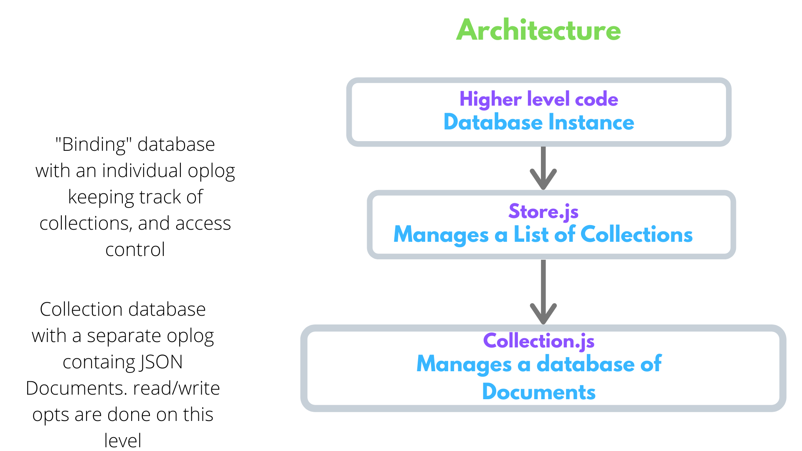

## AvionDB Specs [Draft]

---

> AvionDB aims to bring MongoDB-like developer interface to Web 3.0. This document provides an introduction to the AvionDB.

**DISCLAIMER: This document will be subjected to drastic changes. I assure you, we are not even sure with name of the project 😂 Feel free to jump in to discuss about this document [here](https://discord.gg/sFXyza), and add issues, PR 😉**

This version of document uses [OrbitDB](https://github.com/orbitdb/orbit-db) at its core. OrbitDB provides a powerful way to write, read, update & delete data in a distributed way.

At the core of OrbitDB databases is the OPLOG, where all data are stored as a log of operations, which are then calculated into the appropriate schema for application use. Updating the database is equivalent to adding a new entry to its OPLOG. The OPLOG is calculated to give the current state of the database, which is the view you generally interact with.

OrbitDB stores the data in [IPFS](https://ipfs.io) via [ipfs-log](https://github.com/orbitdb/ipfs-log). OrbitDB helps format how that data is stored, provides access control, and ability to replicate/sync that data between nodes. The only data stored separately by OrbitDB is a cache of heads, the manifest, etc.

OrbitDB organizes its functionality by separating different data management concerns, schemas and APIs into **stores**.

You have the following stores available in OrbitDB out-of-the-box:

| Name                                                                                              | Description                                                                                                                                                                     |
| ------------------------------------------------------------------------------------------------- | ------------------------------------------------------------------------------------------------------------------------------------------------------------------------------- |
| **[log](https://github.com/orbitdb/orbit-db/blob/master/API.md#orbitdblognameaddress)**           | An _immutable_ (append-only) log with traversable history. Useful for _"latest N"_ use cases or as a message queue.                                                             |
| **[feed](https://github.com/orbitdb/orbit-db/blob/master/API.md#orbitdbfeednameaddress)**         | A _mutable_ log with traversable history. Entries can be added and removed. Useful for _"shopping cart"_ type of use cases, or for example as a feed of blog posts or "tweets". |
| **[keyvalue](https://github.com/orbitdb/orbit-db/blob/master/API.md#orbitdbkeyvaluenameaddress)** | A simple key-value database that supports any JSON-serializable data, even nested objects.                                                                                      |
| **[docs](https://github.com/orbitdb/orbit-db/blob/master/API.md#orbitdbdocsnameaddress-options)** | A document database that stores JSON documents which can be indexed by a specified key. Useful for building search indices or version controlling documents and data.           |
| **[counter](https://github.com/orbitdb/orbit-db/blob/master/API.md#orbitdbcounternameaddress)**   | An increment-only integer counter useful for counting events separate from log/feed data.                                                                                       |

### Architecture



AvionDB uses OrbitDB stores to model MongoDB-like Databases. It creates a notion of:

- Each AvionDB instance can have several [Databases](#databases).
- Each Database can have several [Collections](#collections). The strucuture of these Collections are defined by [Schemas](#Schemas)
- Each Collection can have several [Documents](#Documents).

#### Databases

AvionDB maintains a list of Databases using a `kvstore`.

```json
{
  "database1": {
    "address": "/orbitdb/zdpuAsMWWt6GGqBQYhVoTrRfNGCtVtMvoEDmc5QDvFfgn12xL/database1",
    "createdAt": "Sat Mar 28 2020 11:34:26 GMT+0530 (India Standard Time)"
  },
  "database2": {
    "address": "/orbitdb/zdpuAxy3c6kzRWQeP7BdoEXq4tkDdSNMVYfj2Mu44y5NGLffx/database2",
    "createdAt": "Sat Mar 28 2020 11:34:26 GMT+0530 (India Standard Time)"
  }
}
```

This `kvstore` stores basic details about the created databases:

- names of database: `database1`
- address of database that points to Collections `kvstore`: `/orbitdb/zdpuAsMWWt6GGqBQYhVoTrRfNGCtVtMvoEDmc5QDvFfgn12xL/database1`
- other details such as `createdAt`, etc.

#### Collections

AvionDB maintains a list of Collections using a `kvstore`.

```json
{
  "collection1": {
    "address": "/orbitdb/zdpuAyfVXRNSRLyRBqWczweq5VtfZvBSikSLnbSySrZqC1raq/collection1",
    "createdAt": "Sat Mar 28 2020 11:34:26 GMT+0530 (India Standard Time)"
  },
  "collection2": {
    "address": "/orbitdb/zdpuAnnmAJxeeWdxcQb3EUjqBQwCC6qkBf1qJpkJRhDgk9TLM/collection2",
    "createdAt": "Sat Mar 28 2020 11:34:26 GMT+0530 (India Standard Time)"
  }
}
```

This `kvstore` stores basic details about the created collections:

- names of database: `collection1`
- address of database that points to Collections `kvstore`: `/orbitdb/zdpuAyfVXRNSRLyRBqWczweq5VtfZvBSikSLnbSySrZqC1raq/collection1`
- other details such as `createdAt`, etc.

#### Documents

AvionDB maintains a list of Documents using a `docstore`.

```json
[
  {
    "_id": "0",
    "name": "peer1",
    "time": "Sat Mar 28 2020 12: 05: 26 GMT+0530 (India Standard Time)"
  },
  {
    "_id": "1",
    "name": "peer2",
    "time": "Sat Mar 28 2020 12: 05: 26 GMT+0530 (India Standard Time)"
  }
]
```

Each document in the `docstore` is indexed by an `"_id"`. It allows you to add additional application data defined by a [Schema](#Schemas).

#### Schemas

A AvionDB service document schema is a `JSON` object that allows you to define the shape and content of documents and embedded documents in a collection. You can use a schema to require a specific set of fields, configure the content of a field, or to validate changes to a document based on its beginning and ending states.

[TODO: Add Schema Example]

### Supported Methods/Operations

AvionDB creates a wrapper around OrbitDB `put`, `get` methods, allowing for complex queries for adding, updating, fetching & deleting documents.

For example,

- Adding bulk documents at once.
- Updating all the documents in a `Users` collection whos `age` is greater than `21` and `address` is `Canada`.
- Fetching all the documents in a `Users` collection whos `age` is greater than `21` and `address` is `India`.
- Deleting all the documents in a `Users` collection whos `age` is less than `15` and `address` is `Canada`.

### Storing & Retrieving big files

AvionDB supports storing & retrieving big files (file size to be decided) like images, gifs, audio, video, etc. using [MagnumFS](#magnumfs).

#### MagnumFS

MagnumFS uses IPFS to store big files and manages the hashes of the files in AvionDB.

[TODO: Add more detials]

### Decentralized Data Query (Local & Global)

AvionDB allows you to query data in 2 ways: _Local_ & _Global_.

#### Local Data Query

In this type of query, you usually deal with databases which are local to your IPFS node. So, the search happens only within your local AvionDB database.

[TODO: Provide more details]

#### Global Data Query

In this type of query, you deal with database that is distruted among several peers in the network. So, when you query for data, your query is executed over the network of peers.

Here the databases can be pubic/private within a set of peers in the network.

[TODO: Provide more details]

### Dynamic Access Control

AvionDB exposes a powerful dynamic access control, thanks to [OrbitDB's extensible authentication middleware](https://github.com/orbitdb/orbit-db-access-controllers#creating-a-custom-access-controller).

By default OrbitDB uses `OrbitDBAccessController` which can be extended to add additional authentication. This additional authentication can be anything ranging from authenticating with Metmask, 3ID, DIDs, etc., to calling any APIs to validate access.

There is on going discussion on dynamic access control using [ceramic protocol](https://www.ceramic.network/). You can join the dicussion [here](https://discord.gg/cXyREx).

### Data Replication

As we are dealing with databases, we will require to replicate our databases for scaling, backup and sharing data across multiple peers. AvionDB uses [pub-sub](https://github.com/ipfs/interface-js-ipfs-core) to communicate addresses of databases, collections & documents among the peers in the network. Using the addresses, the peers can replicate the databases, collections & documents on their local IPFS nodes.

[TODO: Add more details]

### Encryption/Decryption

AvionDB provides configurable encryption/decryption out-of-the-box. It provides basic encryption (encryption schemes to be decided) which can be configured to use any other encryption schemes of your choice & security needs.

### On-Going Discussions

- **Using [Ceramic Protocol](https://www.ceramic.network/) with AvionDB**: Join the discussion [here](https://discord.gg/cXyREx)
